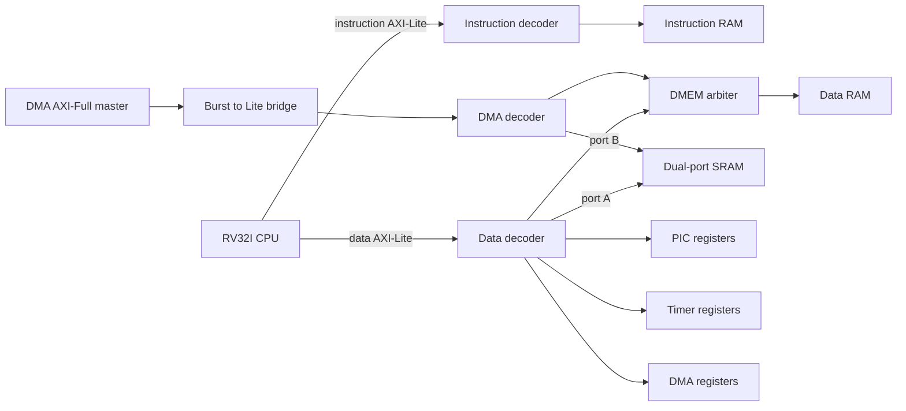

# SoC architecture

The SoC connects a three-stage RV32I CPU, PIC, timer, four-channel DMA and
dual-port SRAM. RTL is in [hdl/](hdl/); the executed test matrix is in
[docs/VERIFICATION.md](docs/VERIFICATION.md). Integrated upstream revisions:
[../INTEGRATION.md](../INTEGRATION.md).

## Data path

The CPU and DMA arbitrate only for data RAM. SRAM provides a separate port to
each master, so simultaneous accesses reach the block's collision logic.

## Address map

Defined by [soc_addr_map.vh](hdl/soc_addr_map.vh). Decoders forward the full
address; each slave uses only the low bits inside its window, which is enough
because every window is aligned to its size.

| Target | Base | Window | CPU instruction | CPU data | DMA |
|---|---|---|---|---|---|
| Instruction RAM | `0x0000_0000` | 8 KiB | Yes | No | No |
| Data RAM | `0x0000_2000` | 8 KiB | No | Shared arbiter | Shared arbiter |
| Dual-port SRAM | `0x1000_0000` | 1 KiB | No | Port A | Port B |
| PIC | `0x3000_0000` | 256 B | No | Yes | No |
| Timer | `0x3001_0000` | 256 B | No | Yes | No |
| DMA registers | `0x3002_0000` | 256 B | No | Yes | No |

An address outside the master's reachable windows returns DECERR. The separate
windows prevent peripheral aliasing across the 64 KiB spacing. Errors returned
by a mapped slave pass through, including DECERR.

## Fabric modules

| Module | Function and contract |
|---|---|
| `soc_axi_lite_dec` | Decode one master onto parameterized windows. AW and W may arrive independently. W waits for an address route. One transaction per channel: the route is held until its response is taken, and the next address is refused meanwhile, on both the master and the slave side. |
| `soc_axi_lite_arb` | Round-robin selection among masters. Select one direction per transaction; write wins if the chosen master offers both. One address and one data beat per grant; ownership is held until the selected response completes. |
| `soc_axi_full2lite` | Split 32-bit INCR/FIXED bursts into Lite transfers; reconstruct RLAST and one write response. Accepted profile: FIXED/INCR, 32-bit beats, word-aligned start address. Anything else answers SLVERR on every beat without reaching the bus. |
| `soc_axi_lite_ram` | Parameterized behavioural memory with byte strobes, response latency and seeded backpressure. |
| `soc_top` | Connect CPU, fabric and current upstream DMA/SRAM interfaces. |

The bridge's merged write-response policy is DECERR > SLVERR > OKAY, independent
of response order. This is a project policy. Read responses retain each beat's
status. CPU access errors become architectural traps.

### One transaction per channel

Every fabric block keeps exactly one route per channel, in a register, and that
register is the whole of its routing state. Taking a second request before the
first response has been handed over would overwrite it, and the pending response
would then be answered from the new destination - delivered to a master that had
not asked for it, and changing under an RVALID it had not yet accepted. So each
block refuses the next request until the current response is taken. Refusing it
costs nothing here: every slave in this SoC already withholds its own READY while
it owes a response, so the cycle was never available to begin with.

This is the same profile as `axi_lite_demux` configured with `MaxTrans = 1` in
[pulp-platform/axi](https://github.com/pulp-platform/axi), which holds the route
for an occupied destination and refuses an address while its counter is full.
`soc/debug/sim/run_pulp_compare.sh` runs both against the same stimulus; see
[docs/VERIFICATION.md](docs/VERIFICATION.md).

Two behaviours differ from that reference:

- This decoder decodes the address itself and answers DECERR for an unmapped one.
  Upstream takes the routing decision as an input and places a separate error
  slave behind a spare port.
- Upstream's burst splitter rewrites any failing beat's response to SLVERR. This
  bridge keeps DECERR > SLVERR > OKAY, so a decode error inside a burst is still
  reported as a decode error.

### Masters that finish what they start

A grant is held from the address to the response, and the bridge forwards a
write address before the burst's data has arrived. The fabric therefore makes
progress as long as no master starts a write whose data depends on a transfer it
has not issued yet: such a write would hold the DMEM arbiter while waiting for
data that can only come through the same arbiter. Neither master in this SoC
does that. The CPU has one access outstanding, and the DMA reads each block
completely before it writes it. A future master that overlaps its reads and
writes needs a fabric that can hold more than one transaction.

Existing parameters remain local to their functional modules. Each procedural
state signal has one `always` owner. CPU/SoC RTL contains no `timescale`.

## Interrupt path

| PIC source | Hardware input |
|---|---|
| 0–3 | DMA channels 0–3 |
| 4 | SRAM interrupt |
| 5–6 | Tied low |
| 7 | Machine timer |
| 8–15 | Tied low |

Software triggers can address all sixteen PIC slots. A DMA interrupt passes the
DMA enable mask, PIC enable mask, CPU `mie[16+n]` and global `mstatus.MIE` before
handler entry. The PIC presents a registered request and four-bit vector.
CPU claim pushes the selected source into service; EOI closes its nesting level.

The current PIC targets one CPU. Shared-memory dual-core verification does not
provide multicore interrupt routing. The common sixteen-source interface is an
explicit project decision resolving differing original brief widths.

DMA/SRAM findings are documented in [../TO_MODIFY.md](../TO_MODIFY.md).
