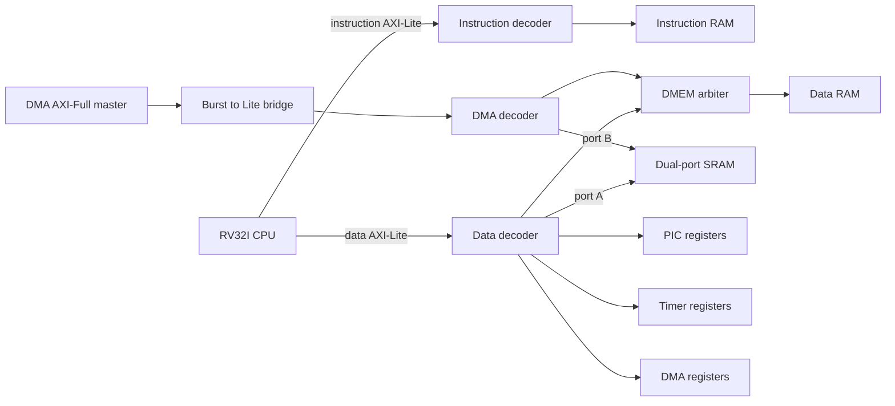

# SoC architecture

The SoC connects a three-stage RV32I CPU, PIC, timer, four-channel DMA and
dual-port SRAM. RTL is in [hdl/](hdl/); the executed test matrix is in
[docs/VERIFICATION.md](docs/VERIFICATION.md). Integrated upstream revisions:
[../INTEGRATION.md](../INTEGRATION.md).

## Data path

The CPU and DMA arbitrate only for data RAM. SRAM provides a separate port to
each master, so simultaneous accesses reach the block's collision logic.

## Address map

Defined by [soc_addr_map.vh](hdl/soc_addr_map.vh). Each decoder subtracts the
selected base address before forwarding the transaction.

| Target | Base | Window | CPU instruction | CPU data | DMA |
|---|---|---|---|---|---|
| Instruction RAM | `0x0000_0000` | 8 KiB | Yes | No | No |
| Data RAM | `0x0000_2000` | 8 KiB | No | Shared arbiter | Shared arbiter |
| Dual-port SRAM | `0x1000_0000` | 1 KiB | No | Port A | Port B |
| PIC | `0x3000_0000` | 256 B | No | Yes | No |
| Timer | `0x3001_0000` | 256 B | No | Yes | No |
| DMA registers | `0x3002_0000` | 256 B | No | Yes | No |

An address outside the master's reachable windows returns DECERR. The separate
windows prevent peripheral aliasing across the 64 KiB spacing. Errors returned
by a mapped slave pass through, including DECERR.

## Fabric modules

| Module | Function and contract |
|---|---|
| `soc_axi_lite_dec` | Decode one master onto parameterized windows. AW and W may arrive independently. W waits for an address route; each write channel is accepted once, and routing is held until the B handshake. |
| `soc_axi_lite_arb` | Round-robin selection among masters. Select one direction per transaction; write wins if the chosen master offers both. Hold ownership until the selected response completes. |
| `soc_axi_full2lite` | Split 32-bit INCR/FIXED bursts into Lite transfers; reconstruct RLAST and one write response. Reject unsupported WRAP/narrow requests. |
| `soc_axi_lite_ram` | Parameterized behavioural memory with byte strobes, response latency and seeded backpressure. |
| `soc_top` | Connect CPU, fabric and current upstream DMA/SRAM interfaces. |

The bridge's merged write-response policy is DECERR > SLVERR > OKAY, independent
of response order. This is a project policy. Read responses retain each beat's
status. CPU access errors become architectural traps.

Existing parameters remain local to their functional modules. Each procedural
state signal has one `always` owner. CPU/SoC RTL contains no `timescale`.

## Interrupt path

| PIC source | Hardware input |
|---|---|
| 0–3 | DMA channels 0–3 |
| 4 | SRAM interrupt |
| 5–6 | Tied low |
| 7 | Machine timer |
| 8–15 | Tied low |

Software triggers can address all sixteen PIC slots. A DMA interrupt passes the
DMA enable mask, PIC enable mask, CPU `mie[16+n]` and global `mstatus.MIE` before
handler entry. The PIC presents a registered request and four-bit vector.
CPU claim pushes the selected source into service; EOI closes its nesting level.

The current PIC targets one CPU. Shared-memory dual-core verification does not
provide multicore interrupt routing. The common sixteen-source interface is an
explicit project decision resolving differing original brief widths.

DMA/SRAM findings and pending interface agreement are documented only in
[../TO_MODIFY.md](../TO_MODIFY.md).
